# 

<div align="center">
  
  <h1>Obrol+</h1>
  <p><strong>Tetap Terhubung, Meski Tanpa Internet</strong></p>
</div>

---

## Tentang Obrol+

**Obrol+** adalah sebuah aplikasi perpesanan peer-to-peer (P2P) inovatif yang dirancang untuk memungkinkan komunikasi di area tanpa akses internet. Dengan memanfaatkan teknologi **Wi-Fi Direct**, Obrol+ menciptakan jaringan lokal antar perangkat, memungkinkan pengguna untuk mengirim pesan, berbagi file, dan bahkan melakukan panggilan suara dalam jarak dekat.

### Tujuan & Solusi

Tujuan utama Obrol+ adalah untuk menyediakan solusi komunikasi yang andal saat konektivitas konvensional tidak tersedia. Aplikasi ini memberikan dampak sosial yang signifikan dengan menjadi alat vital dalam berbagai skenario:

*   **Bantuan Komunikasi Darurat:** Saat terjadi bencana alam atau situasi darurat yang melumpuhkan infrastruktur internet, Obrol+ memungkinkan tim penyelamat atau korban untuk tetap berkoordinasi.
*   **Mendukung Kegiatan Sosial:** Untuk acara komunitas, kegiatan luar ruangan, atau di area pedesaan, Obrol+ membantu orang tetap terhubung tanpa bergantung pada sinyal seluler atau Wi-Fi publik.
*   **Menjembatani Kesenjangan Digital:** Bagi masyarakat di daerah yang tidak memiliki akses internet yang stabil, Obrol+ menyediakan sarana komunikasi dasar yang gratis dan mudah diakses.

---

## Fitur Utama

*   **Mengirim Pesan Teks:** Komunikasi teks yang cepat dan efisien.
*   **Mengirim Media (Gambar/File):** Berbagi gambar atau dokumen penting dengan mudah.
*   **Melakukan Panggilan Suara:** Komunikasi suara secara langsung antar perangkat.
*   **Riwayat Pesan Lokal:** Semua percakapan disimpan dengan aman di perangkat Anda.

---

## Galeri Aplikasi

Berikut adalah beberapa tampilan halaman dari aplikasi Obrol+.

### Tampilan Mode Terang

| Halaman Chat | Halaman Panggilan | Pengaturan Profil |
| :---: | :---: | :---: |
| 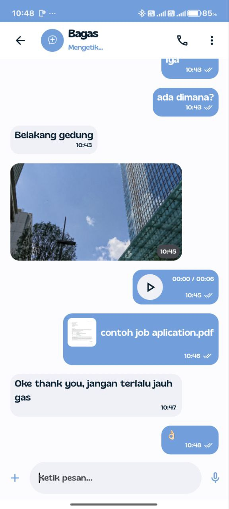 | 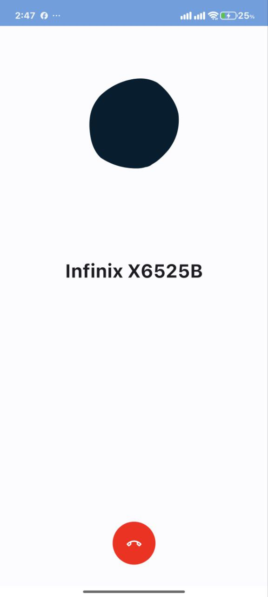 |  |
| **Tampilan Chat** | **Tampilan Panggilan** | **Pengaturan** |

| Chat Layanan | Histori Chat | Halaman Utama |
| :---: | :---: | :---: |
| 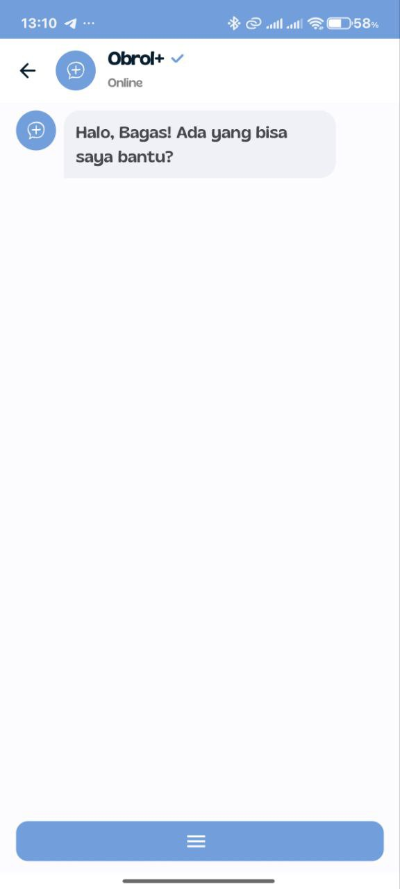 | 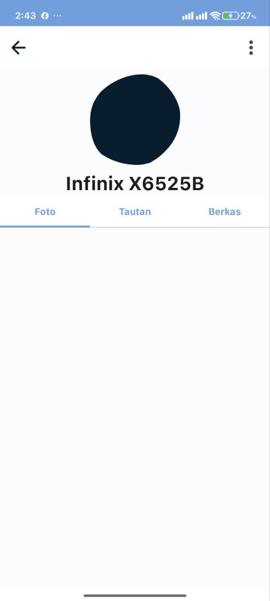 | 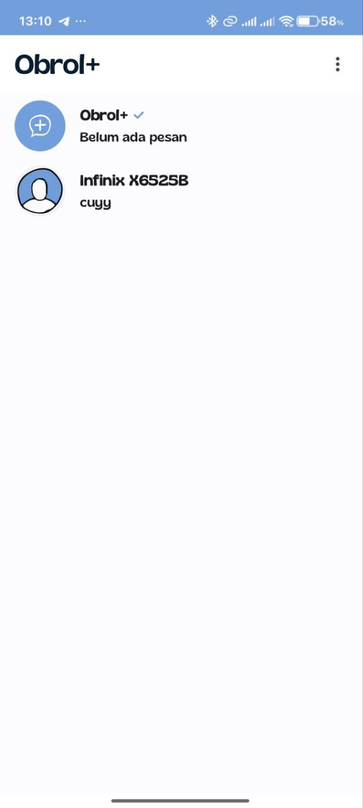 |
| **Chat Bot Layanan** | **Daftar Obrolan** | **Halaman Utama** |

### Tampilan Mode Gelap

| Halaman Chat | Halaman Panggilan | Pengaturan Profil |
| :---: | :---: | :---: |
| 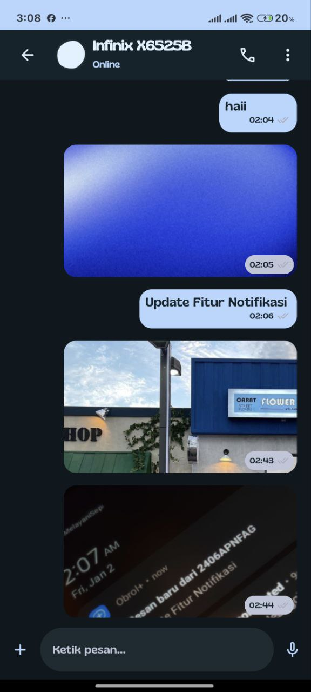 | 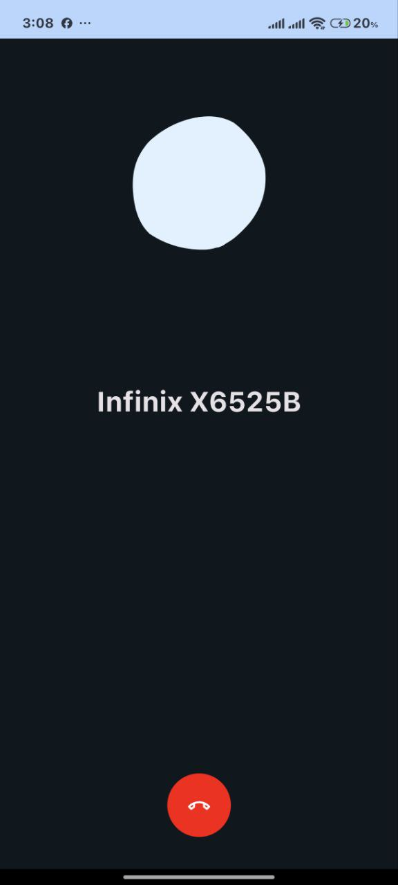 | 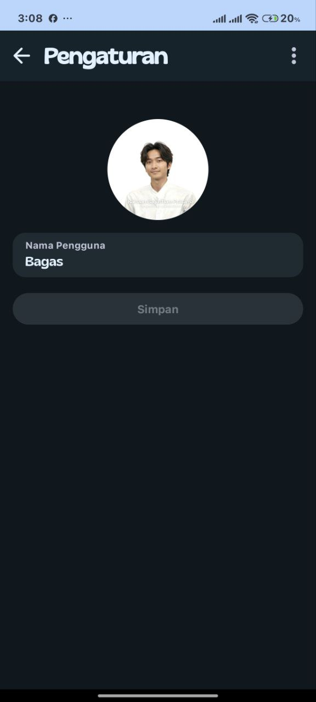 |
| **Tampilan Chat** | **Tampilan Panggilan** | **Pengaturan** |

| Chat Layanan | Histori Chat | Halaman Utama |
| :---: | :---: | :---: |
| 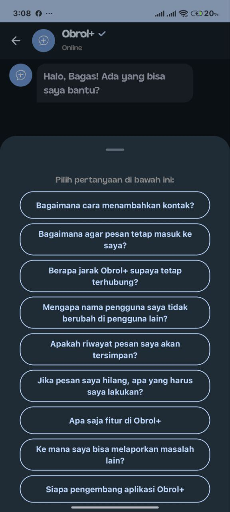 | 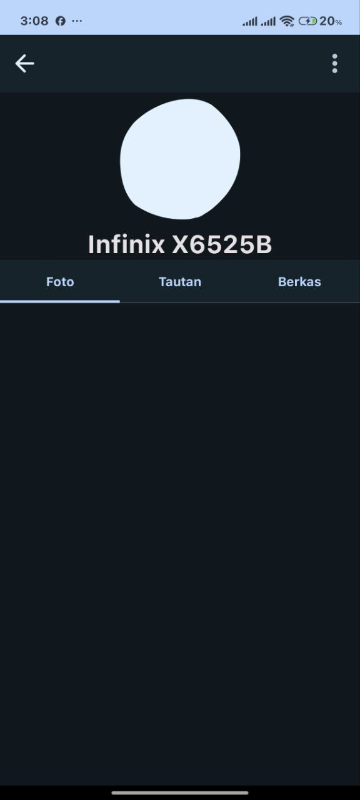 | 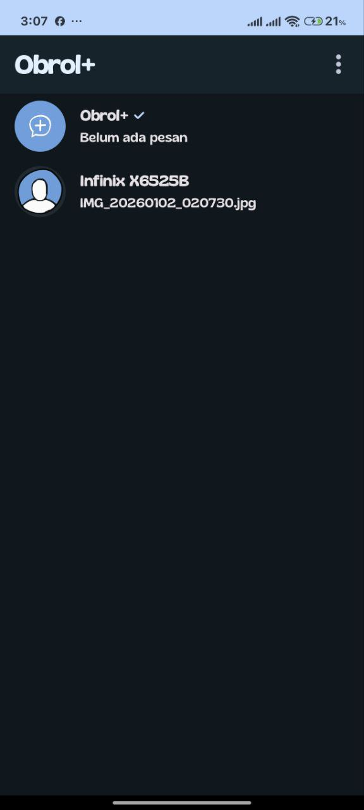 |
| **Chat Bot Layanan** | **Daftar Obrolan** | **Halaman Utama** |

---

## Panduan Pemasangan

Ikuti langkah-langkah berikut untuk meng-clone dan menjalankan proyek ini di Android Studio tanpa masalah.

### 1. Prasyarat Teknis

Pastikan lingkungan pengembangan Anda memenuhi spesifikasi berikut. Ketidakcocokan versi adalah penyebab paling umum kegagalan build.

| Komponen | Versi yang Dibutuhkan |
| :--- | :--- |
| **JDK** | `17` |
| **Android Studio** | `Iguana 2023.2.1` atau lebih baru (direkomendasikan) |
| **Gradle Version** | `8.6` |
| **Android Gradle Plugin**| `8.4.0` |
| **Kotlin Version**| `1.9.0` |


### 2. Langkah-langkah Pemasangan

1.  **Clone Repositori**
    Buka terminal atau Git Bash, lalu jalankan perintah berikut:
    ```bash
    git clone https://github.com/rey13x/obrol-.git
    ```

2.  **Buka Proyek di Android Studio**
    *   Buka Android Studio.
    *   Pilih **File > Open**, lalu arahkan ke folder `obrol+` yang baru saja Anda clone.
    *   Tunggu hingga Android Studio selesai mengindeks file.

3.  **Konfigurasi Gradle JDK (Penting!)**
    *   Buka **File > Settings...** (atau **Android Studio > Settings...** di macOS).
    *   Arahkan ke **Build, Execution, Deployment > Build Tools > Gradle**.
    *   Di bagian **Gradle JDK**, pilih **JDK versi 17**. Jika tidak ada, unduh melalui Android Studio.
    *   Klik **Apply** lalu **OK**.

4.  **Sinkronkan Proyek**
    *   Setelah konfigurasi JDK benar, klik ikon **Sync Project with Gradle Files** (gajah dengan panah) di toolbar atas.
    *   Gradle akan secara otomatis mengunduh versi `8.6` dan semua dependensi yang diperlukan. Proses ini mungkin memakan waktu beberapa menit.

5.  **Jalankan Aplikasi**
    *   Proyek ini **sangat direkomendasikan untuk dijalankan di perangkat Android fisik**, karena emulator umumnya tidak mendukung Wi-Fi Direct dengan baik.
    *   Anda akan memerlukan **dua perangkat fisik** untuk menguji fungsionalitas chat.
    *   Hubungkan perangkat Anda, lalu klik tombol **Run 'app'** (ikon play hijau).

---

## Batasan Aplikasi

Harap dicatat bahwa Obrol+ memiliki beberapa batasan teknis:

*   **Jarak Terbatas:** Efektif digunakan dalam jarak dekat, sekitar **10-20 meter**.
*   **Koneksi Langsung:** Pesan hanya dapat terkirim jika kedua perangkat sedang terhubung secara aktif dalam jaringan Wi-Fi Direct.
*   **Bukan Pengganti:** Aplikasi ini dirancang sebagai pelengkap, bukan untuk menggantikan aplikasi chat berbasis internet untuk komunikasi jarak jauh.

---

## Dibuat Oleh

**Raihaan Bagastiam Pratama\n**
**From SMKN 2 Kota Bekasi**

---
